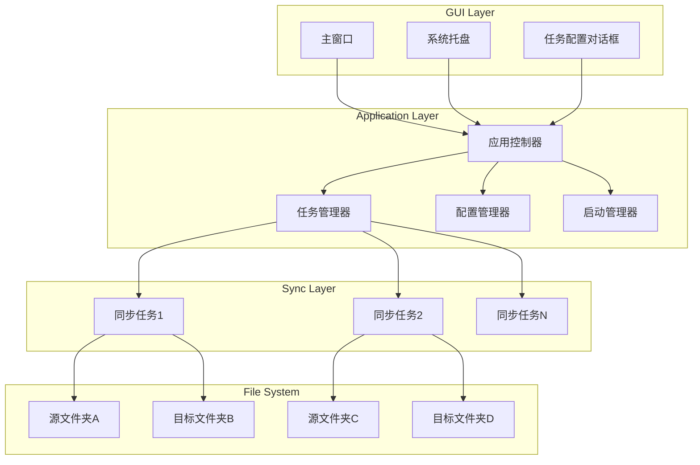

# 设计文档

## 概述

文件夹同步系统是一个基于Python的桌面应用程序，使用PySide6构建图形界面，watchdog库实现文件系统监控，支持多任务管理、系统托盘运行和开机自启动。应用程序采用事件驱动架构，每个同步任务独立运行，通过观察者模式监听文件系统变化并执行相应的同步操作。

### 技术栈

- **Python 3.8+**: 主要编程语言
- **uv**: 现代化的Python包管理器和项目管理工具
- **PySide6**: GUI框架，提供跨平台的图形界面和系统托盘支持
- **watchdog**: 文件系统监控库，跨平台支持文件事件监听
- **PyInstaller**: 打包工具，将Python应用打包为Windows可执行文件
- **winreg**: Python标准库，用于操作Windows注册表
- **mypy**: 静态类型检查工具，确保类型安全

### 设计原则

1. **简单直观**: GUI界面简洁清晰，操作流程直观
2. **独立任务**: 每个同步任务独立运行，互不影响
3. **实时响应**: 文件变化立即触发同步操作
4. **容错性**: 单个任务错误不影响其他任务运行
5. **可维护性**: 模块化设计，职责清晰分离
6. **类型安全**: 使用严格的类型注解和类型检查，将Python作为强类型语言使用

## 架构

### 系统架构图



### 架构层次

1. **GUI层**: 负责用户交互，包括主窗口、系统托盘和对话框
2. **应用层**: 核心业务逻辑，管理任务、配置和启动项
3. **同步层**: 执行具体的文件监控和同步操作
4. **文件系统层**: 实际的文件和目录

## 组件和接口

### 1. 主窗口 (MainWindow)

**职责**: 提供主要的用户界面，显示任务列表和操作按钮

**主要功能**:
- 显示所有同步任务的列表（表格形式）
- 提供添加、删除、启动、停止任务的按钮
- 显示每个任务的状态（运行中/已停止）
- 提供设置按钮，打开设置对话框
- 最小化到系统托盘

**接口**:
```python
class MainWindow(QMainWindow):
    def __init__(self, app_controller: AppController)
    def add_task_clicked(self) -> None
    def delete_task_clicked(self) -> None
    def start_task_clicked(self) -> None
    def stop_task_clicked(self) -> None
    def settings_clicked(self) -> None
    def update_task_list(self, tasks: List[TaskConfig]) -> None
    def update_task_status(self, task_id: str, status: str) -> None
    def closeEvent(self, event: QCloseEvent) -> None  # 最小化到托盘
```

### 2. 系统托盘 (SystemTray)

**职责**: 提供系统托盘图标和菜单，允许后台运行

**主要功能**:
- 显示托盘图标
- 提供右键菜单（显示窗口、退出）
- 单击图标显示/隐藏主窗口
- 显示通知消息

**接口**:
```python
class SystemTray(QSystemTrayIcon):
    def __init__(self, app_controller: AppController)
    def show_window(self) -> None
    def quit_application(self) -> None
    def show_notification(self, title: str, message: str) -> None
    def icon_activated(self, reason: QSystemTrayIcon.ActivationReason) -> None
```

### 3. 任务配置对话框 (TaskDialog)

**职责**: 提供添加/编辑同步任务的界面

**主要功能**:
- 选择源文件夹（文件夹选择对话框）
- 选择目标文件夹（文件夹选择对话框）
- 验证路径有效性
- 返回任务配置

**接口**:
```python
class TaskDialog(QDialog):
    def __init__(self, parent: QWidget, task: Optional[TaskConfig] = None)
    def browse_source(self) -> None
    def browse_target(self) -> None
    def validate_paths(self) -> bool
    def get_task_config(self) -> TaskConfig
```

### 4. 设置对话框 (SettingsDialog)

**职责**: 提供应用程序设置界面

**主要功能**:
- 开机自启动复选框
- 日志级别选择
- 其他应用程序设置

**接口**:
```python
class SettingsDialog(QDialog):
    def __init__(self, parent: QWidget, config: AppConfig)
    def toggle_autostart(self, enabled: bool) -> None
    def set_log_level(self, level: str) -> None
    def get_settings(self) -> dict
```

### 5. 应用控制器 (AppController)

**职责**: 协调GUI和业务逻辑，处理用户操作

**主要功能**:
- 初始化应用程序
- 处理GUI事件
- 调用任务管理器执行操作
- 管理配置和启动项

**接口**:
```python
class AppController:
    def __init__(self)
    def initialize(self) -> None
    def add_task(self, source: str, target: str) -> None
    def delete_task(self, task_id: str) -> None
    def start_task(self, task_id: str) -> None
    def stop_task(self, task_id: str) -> None
    def get_all_tasks(self) -> List[TaskConfig]
    def open_settings(self) -> None
    def set_autostart(self, enabled: bool) -> None
    def set_log_level(self, level: str) -> None
    def shutdown(self) -> None
```

### 6. 任务管理器 (TaskManager)

**职责**: 管理所有同步任务的生命周期

**主要功能**:
- 创建和销毁同步任务
- 启动和停止任务
- 维护任务状态
- 处理任务错误

**接口**:
```python
class TaskManager:
    def __init__(self, config_manager: ConfigManager)
    def create_task(self, config: TaskConfig) -> str
    def delete_task(self, task_id: str) -> None
    def start_task(self, task_id: str) -> None
    def stop_task(self, task_id: str) -> None
    def get_task_status(self, task_id: str) -> str
    def get_all_tasks(self) -> Dict[str, SyncTask]
    def stop_all_tasks(self) -> None
```

### 7. 同步任务 (SyncTask)

**职责**: 执行单个文件夹对的监控和同步

**主要功能**:
- 监控源文件夹的文件系统事件
- 执行初始同步
- 处理文件创建、修改、删除、移动事件
- 错误处理和重试
- 记录日志

**接口**:
```python
class SyncTask:
    def __init__(self, task_id: str, source: str, target: str)
    def start(self) -> None
    def stop(self) -> None
    def is_running(self) -> bool
    def initial_sync(self) -> None
    def on_created(self, event: FileSystemEvent) -> None
    def on_modified(self, event: FileSystemEvent) -> None
    def on_deleted(self, event: FileSystemEvent) -> None
    def on_moved(self, event: FileSystemEvent) -> None
    def sync_file(self, src_path: str, dst_path: str) -> None
    def delete_file(self, path: str) -> None
```

### 8. 文件事件处理器 (FileEventHandler)

**职责**: watchdog的事件处理器，将文件系统事件转发给SyncTask

**主要功能**:
- 继承watchdog的FileSystemEventHandler
- 过滤和处理文件系统事件
- 调用SyncTask的相应方法

**接口**:
```python
class FileEventHandler(FileSystemEventHandler):
    def __init__(self, sync_task: SyncTask)
    def on_created(self, event: FileSystemEvent) -> None
    def on_modified(self, event: FileSystemEvent) -> None
    def on_deleted(self, event: FileSystemEvent) -> None
    def on_moved(self, event: FileSystemMovedEvent) -> None
```

### 9. 配置管理器 (ConfigManager)

**职责**: 管理应用程序配置的持久化

**主要功能**:
- 加载配置文件
- 保存配置文件
- 验证配置数据
- 提供默认配置

**接口**:
```python
class ConfigManager:
    def __init__(self, config_path: str)
    def load_config(self) -> AppConfig
    def save_config(self, config: AppConfig) -> None
    def add_task_config(self, task: TaskConfig) -> None
    def remove_task_config(self, task_id: str) -> None
    def get_all_task_configs(self) -> List[TaskConfig]
```

### 10. 启动管理器 (StartupManager)

**职责**: 管理Windows开机自启动

**主要功能**:
- 添加注册表启动项
- 删除注册表启动项
- 检查启动项状态

**接口**:
```python
class StartupManager:
    def __init__(self, app_name: str, exe_path: str)
    def enable_autostart(self) -> bool
    def disable_autostart(self) -> bool
    def is_autostart_enabled(self) -> bool
```

## 数据模型

### TaskConfig

任务配置数据结构

```python
@dataclass
class TaskConfig:
    task_id: str          # 唯一标识符（UUID）
    source_path: str      # 源文件夹路径
    target_path: str      # 目标文件夹路径
    created_at: str       # 创建时间（ISO格式）
    
    def to_dict(self) -> dict
    def from_dict(data: dict) -> TaskConfig
```

### AppConfig

应用程序配置数据结构

```python
@dataclass
class AppConfig:
    tasks: List[TaskConfig]    # 所有任务配置
    autostart: bool            # 是否开机自启动
    log_level: str             # 日志级别
    
    def to_dict(self) -> dict
    def from_dict(data: dict) -> AppConfig
```

### 配置文件格式

配置文件使用JSON格式存储在用户目录：

```json
{
  "tasks": [
    {
      "task_id": "uuid-1234-5678",
      "source_path": "C:/Users/User/FolderA",
      "target_path": "D:/Backup/FolderB",
      "created_at": "2026-01-07T10:30:00"
    },
    {
      "task_id": "uuid-8765-4321",
      "source_path": "C:/Users/User/FolderC",
      "target_path": "D:/Backup/FolderD",
      "created_at": "2026-01-07T11:00:00"
    }
  ],
  "autostart": true,
  "log_level": "INFO"
}
```

配置文件路径: `%APPDATA%/FolderSync/config.json`


## 正确性属性

*属性是一个特征或行为，应该在系统的所有有效执行中保持为真——本质上是关于系统应该做什么的形式化陈述。属性作为人类可读规范和机器可验证正确性保证之间的桥梁。*

### 属性 1: 文件创建同步

*对于任意*源文件夹中创建的文件，该文件应该在目标文件夹的相应位置被创建，且内容完全相同

**验证需求: 1.1, 1.2**

### 属性 2: 子目录文件创建同步

*对于任意*在源文件夹子目录中创建的文件，目标文件夹应该创建相同的目录结构，并在相应位置创建内容相同的文件

**验证需求: 1.3**

### 属性 3: 文件修改同步

*对于任意*源文件夹中被修改的文件，目标文件夹中的对应文件应该被新内容完全覆盖

**验证需求: 2.1, 2.2**

### 属性 4: 文件删除同步

*对于任意*从源文件夹中删除的文件，目标文件夹中的对应文件也应该被删除

**验证需求: 3.1**

### 属性 5: 目录删除同步

*对于任意*从源文件夹中删除的目录，目标文件夹中的对应目录及其所有内容也应该被删除

**验证需求: 3.2, 4.2**

### 属性 6: 目录创建同步

*对于任意*在源文件夹中创建的目录，目标文件夹中应该创建相同路径的目录

**验证需求: 4.1**

### 属性 7: 文件移动同步

*对于任意*在源文件夹中移动的文件或目录，目标文件夹中应该执行相同的移动操作，使得文件/目录出现在新位置而不是旧位置

**验证需求: 4.3**

### 属性 8: 监控错误恢复

*对于任意*监控过程中发生的错误，系统应该记录错误信息并继续监控其他文件系统事件

**验证需求: 5.4**

### 属性 9: 初始同步完整性

*对于任意*源文件夹的文件和目录结构，执行初始同步后，目标文件夹应该包含所有相同的文件和目录，且文件内容完全相同

**验证需求: 6.2**

### 属性 10: 初始同步覆盖

*对于任意*目标文件夹中已存在的文件，执行初始同步时应该被源文件夹中的对应文件覆盖

**验证需求: 6.3**

### 属性 11: 复制错误隔离

*对于任意*文件复制失败的情况，系统应该记录错误信息并继续处理其他文件的同步操作

**验证需求: 7.3**

### 属性 12: 错误消息完整性

*对于任意*发生的错误，系统输出的错误消息应该包含文件路径和错误原因

**验证需求: 7.5**

### 属性 13: 操作日志记录

*对于任意*执行的同步操作，系统应该记录包含操作类型、文件路径和时间戳的日志条目

**验证需求: 8.1**

### 属性 14: 错误日志记录

*对于任意*发生的错误，系统应该记录错误级别的日志信息

**验证需求: 8.2**

### 属性 15: 任务列表显示

*对于任意*已配置的同步任务集合，GUI应该显示所有任务，且每个任务显示源路径、目标路径和当前状态

**验证需求: 9.1, 9.4**

### 属性 16: 多任务独立运行

*对于任意*多个同步任务，它们应该能够同时独立运行，一个任务的操作不影响其他任务

**验证需求: 10.1**

### 属性 17: 配置持久化往返

*对于任意*添加的同步任务，该任务应该被保存到配置文件，且应用程序重启后能够从配置文件加载该任务

**验证需求: 10.2, 10.3, 14.1, 14.3**

### 属性 18: 任务状态隔离

*对于任意*同步任务，其监控状态和日志应该独立维护，不与其他任务混淆

**验证需求: 10.4**

### 属性 19: 任务错误隔离

*对于任意*发生错误的同步任务，其他任务应该继续正常运行不受影响

**验证需求: 10.5**

### 属性 20: 托盘通知

*对于任意*同步任务发生的重要事件或错误，系统托盘应该显示相应的通知消息

**验证需求: 11.5**

### 属性 21: 自启动注册表往返

*对于任意*启用开机自启动的操作，系统应该在Windows注册表中添加启动项，且禁用时应该移除该启动项

**验证需求: 12.2, 12.3**

### 属性 22: 任务停止隔离

*对于任意*被停止的单个任务，其他正在运行的任务应该继续运行不受影响

**验证需求: 15.4**

## 错误处理

### 错误类型和处理策略

1. **路径错误**
   - 源文件夹不存在: 启动时验证，报告错误并拒绝启动任务
   - 目标文件夹不存在: 自动创建目标文件夹
   - 路径无效: 在配置时验证，拒绝无效路径

2. **文件操作错误**
   - 权限不足: 记录错误，显示通知，继续处理其他文件
   - 磁盘空间不足: 记录错误，显示通知，暂停任务
   - 文件被占用: 重试3次（每次间隔1秒），失败后记录错误并继续

3. **配置错误**
   - 配置文件损坏: 创建新的默认配置文件
   - JSON解析失败: 记录错误，使用默认配置
   - 配置文件不可写: 记录错误，仅在内存中维护配置

4. **系统错误**
   - 注册表访问失败: 记录错误，禁用自启动功能
   - 托盘图标创建失败: 记录错误，仅显示主窗口
   - watchdog初始化失败: 记录错误，拒绝启动任务

### 错误恢复机制

1. **重试机制**: 文件被占用时自动重试，最多3次
2. **任务隔离**: 单个任务错误不影响其他任务
3. **优雅降级**: 非关键功能失败时继续运行核心功能
4. **用户通知**: 重要错误通过托盘通知告知用户

### 日志记录

所有错误都应该记录到日志文件，包含：
- 时间戳
- 错误级别（ERROR, WARNING）
- 任务ID（如果适用）
- 文件路径（如果适用）
- 错误描述
- 堆栈跟踪（对于异常）

日志文件位置: `%APPDATA%/FolderSync/logs/sync.log`

## 测试策略

### 双重测试方法

本项目采用单元测试和基于属性的测试相结合的方法，以确保全面的代码覆盖和正确性验证。

**单元测试**用于验证：
- 特定的示例场景
- 边缘情况（空文件夹、特殊字符、长路径）
- 错误条件（权限错误、磁盘满）
- 组件之间的集成点
- UI交互流程

**基于属性的测试**用于验证：
- 通用属性在所有输入下都成立
- 通过随机化实现全面的输入覆盖
- 文件同步的正确性属性
- 配置持久化的往返属性
- 多任务隔离属性

### 测试框架和工具

- **单元测试框架**: pytest
- **基于属性的测试库**: Hypothesis
- **GUI测试**: pytest-qt (PySide6测试支持)
- **模拟库**: unittest.mock
- **覆盖率工具**: pytest-cov

### 基于属性的测试配置

每个属性测试应该：
- 运行最少100次迭代（由于随机化）
- 使用注释标记引用设计文档中的属性
- 标记格式: `# Feature: folder-sync, Property {number}: {property_text}`
- 每个正确性属性由单个属性测试实现

### 测试组织

```
tests/
├── unit/
│   ├── test_sync_task.py          # 同步任务单元测试
│   ├── test_config_manager.py     # 配置管理器单元测试
│   ├── test_task_manager.py       # 任务管理器单元测试
│   ├── test_startup_manager.py    # 启动管理器单元测试
│   └── test_gui.py                # GUI组件单元测试
├── property/
│   ├── test_sync_properties.py    # 文件同步属性测试
│   ├── test_config_properties.py  # 配置持久化属性测试
│   └── test_isolation_properties.py # 任务隔离属性测试
└── integration/
    ├── test_end_to_end.py         # 端到端集成测试
    └── test_multi_task.py         # 多任务集成测试
```

### 测试数据生成策略

使用Hypothesis生成测试数据：
- **文件路径**: 生成有效的Windows路径，包括子目录
- **文件内容**: 生成随机字节数据和文本数据
- **文件名**: 生成包含特殊字符的合法文件名
- **目录结构**: 生成随机的目录树结构
- **任务配置**: 生成有效的任务配置对象

### 边缘情况测试

单元测试应该覆盖：
- 空文件夹同步
- 大文件同步（>100MB）
- 深层目录结构（>10层）
- 特殊字符文件名（中文、空格、符号）
- 只读文件处理
- 符号链接处理
- 同时修改多个文件
- 快速连续的文件操作

### 性能测试

虽然不是主要关注点，但应该验证：
- 1000个文件的初始同步在合理时间内完成
- 监控不会导致CPU使用率过高
- 内存使用在可接受范围内

### 集成测试

验证组件协作：
- GUI操作触发正确的后端行为
- 配置更改正确保存和加载
- 多个任务同时运行不冲突
- 系统托盘和主窗口正确交互
- 开机自启动正确设置和移除

## 实现注意事项

### 类型安全

**严格的类型注解要求**:
- 所有函数和方法必须有完整的类型注解（参数和返回值）
- 所有类属性必须有类型注解
- 使用 `typing` 模块的类型（List, Dict, Optional, Union等）
- 避免使用 `Any` 类型，除非绝对必要
- 使用 `dataclass` 装饰器定义数据类

**类型检查工具**:
- 使用 `mypy` 进行静态类型检查
- 配置 `mypy` 为严格模式（`--strict`）
- 在CI/CD中集成类型检查
- 类型检查必须通过才能合并代码

**类型注解示例**:
```python
from typing import List, Dict, Optional
from dataclasses import dataclass

@dataclass
class TaskConfig:
    task_id: str
    source_path: str
    target_path: str
    created_at: str

def create_task(source: str, target: str) -> TaskConfig:
    """创建新的任务配置"""
    ...

def get_all_tasks() -> List[TaskConfig]:
    """获取所有任务配置"""
    ...

def find_task(task_id: str) -> Optional[TaskConfig]:
    """查找指定ID的任务，不存在返回None"""
    ...
```

**mypy配置文件** (`mypy.ini`):
```ini
[mypy]
python_version = 3.8
warn_return_any = True
warn_unused_configs = True
disallow_untyped_defs = True
disallow_any_unimported = True
no_implicit_optional = True
warn_redundant_casts = True
warn_unused_ignores = True
warn_no_return = True
check_untyped_defs = True
strict_equality = True
```

### 线程安全

- 每个SyncTask在独立线程中运行
- 使用线程锁保护共享资源（配置文件、日志文件）
- GUI更新使用Qt的信号槽机制确保线程安全

### 性能优化

- 使用watchdog的原生监控机制，避免轮询
- 批量处理快速连续的文件事件（防抖）
- 大文件使用流式复制，避免一次性加载到内存

### 用户体验

- 操作响应迅速，避免阻塞UI线程
- 提供清晰的状态指示（运行中/已停止）
- 错误消息友好易懂
- 托盘通知不过于频繁

### 打包配置

PyInstaller打包命令示例：
```bash
pyinstaller --onefile --windowed --icon=app.ico --name=FolderSync main.py
```

参数说明：
- `--onefile`: 打包成单个exe文件
- `--windowed`: 不显示控制台窗口
- `--icon`: 指定应用程序图标
- `--name`: 指定exe文件名

需要在spec文件中包含的数据文件：
- 应用程序图标
- 默认配置模板

### 部署考虑

- 使用 uv 管理项目依赖和虚拟环境
- 首次运行时创建配置目录
- 提供卸载时清理配置的选项
- 支持便携模式（配置文件在exe同目录）

### 项目结构

```
folder-sync/
├── pyproject.toml          # uv 项目配置文件
├── uv.lock                 # 依赖锁定文件
├── .python-version         # Python 版本指定
├── src/
│   └── folder_sync/
│       ├── __init__.py
│       ├── main.py
│       ├── models.py
│       ├── config_manager.py
│       ├── task_manager.py
│       ├── sync_task.py
│       ├── startup_manager.py
│       ├── app_controller.py
│       └── gui/
│           ├── __init__.py
│           ├── main_window.py
│           ├── task_dialog.py
│           ├── settings_dialog.py
│           └── system_tray.py
├── tests/
│   ├── unit/
│   ├── property/
│   └── integration/
├── mypy.ini
└── README.md
```
